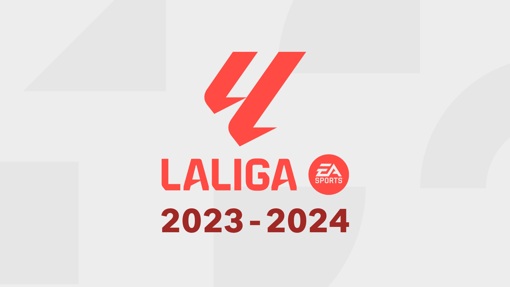

# La Liga 2023/24: Data Insights and Analytics
## Machine Learning and Insights for La Liga 2023/24

### Final Standings: La Liga 2023/24 Season

The table below shows the final standings for all 20 teams based on their performance across 38 matches in the 2023/24 La Liga season:

| Rank | Team               | Played | Wins | Draws | Losses | Goals For | Goals Against | Goal Difference | Points |
|------|--------------------|--------|------|-------|--------|-----------|----------------|-----------------|--------|
| 1    | Real Madrid        | 38     | 29   | 8     | 1      | 87        | 26             | 61              | 95     |
| 2    | Barcelona          | 38     | 26   | 7     | 5      | 79        | 44             | 35              | 85     |
| 3    | Girona             | 38     | 25   | 6     | 7      | 85        | 46             | 39              | 81     |
| 4    | Atletico Madrid    | 38     | 24   | 4     | 10     | 70        | 43             | 27              | 76     |
| 5    | Athletic Club      | 38     | 19   | 11    | 8      | 61        | 37             | 24              | 68     |
| 6    | Real Sociedad      | 38     | 16   | 12    | 10     | 51        | 39             | 12              | 60     |
| 7    | Real Betis         | 38     | 14   | 15    | 9      | 48        | 45             | 3               | 57     |
| 8    | Villarreal         | 38     | 14   | 11    | 13     | 65        | 65             | 0               | 53     |
| 9    | Valencia           | 38     | 13   | 10    | 15     | 40        | 45             | -5              | 49     |
| 10   | Deportivo Alaves   | 38     | 12   | 10    | 16     | 36        | 46             | -10             | 46     |
| 11   | Osasuna            | 38     | 12   | 9     | 17     | 45        | 56             | -11             | 45     |
| 12   | Getafe             | 38     | 10   | 13    | 15     | 42        | 54             | -12             | 43     |
| 13   | Sevilla            | 38     | 10   | 11    | 17     | 48        | 54             | -6              | 41     |
| 14   | Celta Vigo         | 38     | 10   | 11    | 17     | 46        | 57             | -11             | 41     |
| 15   | Mallorca           | 38     | 8    | 16    | 14     | 33        | 44             | -11             | 40     |
| 16   | Las Palmas         | 38     | 10   | 10    | 18     | 33        | 47             | -14             | 40     |
| 17   | Rayo Vallecano     | 38     | 8    | 14    | 16     | 29        | 48             | -19             | 38     |
| 18   | Cadiz              | 38     | 6    | 15    | 17     | 26        | 55             | -29             | 33     |
| 19   | Almeria            | 38     | 3    | 12    | 23     | 43        | 75             | -32             | 21     |
| 20   | Granada            | 38     | 4    | 9     | 25     | 38        | 79             | -41             | 21     |

## Introduction

La Liga, the top-tier football league in Spain, is one of the most competitive and popular leagues in the world, featuring globally recognized teams and players. The 2023/24 season presents an exciting opportunity to delve into the performance metrics of players, teams, and matches across 38 competitive rounds.

This repository aims to provide actionable insights into the league by leveraging advanced data analysis and machine learning techniques. By analyzing team and player statistics, match outcomes, and advanced metrics like expected goals (xG), this project seeks to uncover patterns that define success in La Liga. Whether you're a football enthusiast, a data analyst, or both, this repository offers a data-driven approach to understanding the beautiful game.

The core focus is to provide:
- **Team-Level Insights**: Evaluating team strategies, offensive and defensive performances, and factors that influence standings across home and away games.
- **Player-Level Insights**: Highlighting individual contributions, from goal-scoring abilities to defensive work rates, and identifying the league's standout players.

## Table of Contents

1. [Introduction](#introduction)  
2. [Dataset Overview](#dataset-overview)  
   - [FIFA Datasets](#fifa-datasets)  
   - [Additional Datasets](#additional-datasets)  
3. [Project Objectives](#project-objectives)  
4. [Files and Structure](#files-and-structure)  
5. [Project Notebooks](#project-notebooks)  
   - [`la_liga_matches.ipynb`](#la_liga_matchesipynb)  
   - [`la_liga_players.ipynb`](#la_liga_playersipynb)  
   - [`la_liga_teams.ipynb`](#la_liga_teamsipynb)  
6. [Methodology](#methodology)  
   - [Data Processing](#data-processing)  
   - [Analysis](#analysis)  
   - [Deliverables](#deliverables)  
7. [Future Opportunities](#future-opportunities)  
8. [Acknowledgments](#acknowledgments)  
9. [License](#license)  

## Dataset Overview

The dataset is a comprehensive collection of La Liga 2023/24 season metrics, offering detailed insights into team and player performances across 38 matches. It captures both raw and advanced metrics to facilitate a holistic understanding of the league's dynamics.

### Team-Level Metrics

This dataset includes key performance indicators (KPIs) for all La Liga teams, providing a snapshot of their tactical and strategic approaches throughout the season. Key metrics include:
- **Offensive Statistics**: Goals scored, expected goals (xG), big chances created, and touches in the opposition's box.
- **Defensive Statistics**: Goals conceded, expected goals conceded (xGA), tackles won, interceptions, and defensive clearances.
- **Possession Metrics**: Possession percentages and possessions won in the attacking third.
- **Discipline Metrics**: Yellow and red cards received, fouls committed, and penalties conceded.

These metrics allow for:
- **Trend Analysis**: Understanding how teams adapt their strategies over the season.
- **Home vs. Away Performance**: Identifying teams that perform better on home turf versus away games.
- **Comparative Analysis**: Benchmarking teams against each other to identify strengths and weaknesses.

### Player-Level Metrics

The player-level data provides granular details about individual performances, helping to highlight key contributors and rising stars in the league. Metrics include:
- **Offensive Metrics**: Goals scored, assists, expected goals (xG), expected assists (xA), and shots on target.
- **Defensive Metrics**: Tackles won, interceptions, clearances, and blocks.
- **Goalkeeper Metrics**: Saves made, clean sheets, and goals conceded.
- **Discipline Metrics**: Fouls committed, yellow cards, and red cards.
- **Advanced Metrics**: Expected goals per 90 minutes, assists per 90 minutes, and possessions won in the attacking third.

This data enables:
- **Performance Ranking**: Identifying top scorers, playmakers, and defensive anchors.
- **Role Analysis**: Clustering players by roles, such as goal-scorers, playmakers, and defensive specialists.
- **Comparative Insights**: Benchmarking players within their teams and against league-wide averages.

### Match Insights

The match data provides a chronological view of the season, capturing the outcomes of all 38 rounds. Key details include:
- Match scores, home and away team names, and round-specific details.
- The status of matches (completed, canceled, or in-progress).
- Advanced league tables, including standings based on xG and other performance metrics.

Together, these datasets form a robust foundation for exploring La Liga's dynamics, from individual brilliance to team strategies. By merging player stats, team stats, and match outcomes, this project aims to uncover hidden patterns and provide a deeper understanding of what defines success in the league.

#### **FIFA Datasets**
- `la_liga_stadiums_map.html`: Interactive map visualization for La Liga stadiums.

- **`laliga2023_34/player_stats`**:
  - `player_accurate_long_balls.csv`: Accuracy of long passes for players.
  - `player_accurate_passes.csv`: Overall pass accuracy metrics.
  - `player_big_chances_created.csv`: Count of big scoring chances created by players.
  - `player_big_chances_missed.csv`: Big chances missed during the season.
  - `player_clean_sheets.csv`: Clean sheet records by goalkeepers.
  - `player_contests_won.csv`: Total contests won across matches.
  - `player_effective_clearances.csv`: Defensive clearances per 90 minutes.
  - `player_expected_assists.csv`: Expected assists (xA) metric.
  - `player_expected_assists_per_90.csv`: xA normalized per 90 minutes.
  - `player_expected_goals.csv`: Expected goals (xG) metric.
  - `player_expected_goals_per_90.csv`: xG normalized per 90 minutes.
  - `player_expected_goals_on_target.csv`: xG on target shots.
  - `player_fouls_committed.csv`: Total fouls committed.
  - `player_goals_conceded.csv`: Goals conceded by defenders and goalkeepers.
  - `player_goals_per_90.csv`: Goals scored per 90 minutes.
  - `player_interceptions.csv`: Defensive interceptions made.
  - `player_on_target_scoring_attempts.csv`: Shots on target.
  - `player_outfielder_blocks.csv`: Blocks made by outfield players.
  - `player_penalties_conceded.csv`: Penalties conceded by players.
  - `player_penalties_won.csv`: Penalties won for their teams.
  - `player_player_ratings.csv`: Average player ratings.
  - `player_possessions_won_attacking_third.csv`: Possessions won in the attacking third.
  - `player_red_cards.csv`: Number of red cards.
  - `player_saves_made.csv`: Saves made by goalkeepers.
  - `player_tackles_won.csv`: Tackles won during matches.
  - `player_top_assists.csv`: Players with the most assists.
  - `player_top_scorers.csv`: Top goal scorers.
  - `player_total_assists_in_attack.csv`: Assists in attacking plays.
  - `player_total_scoring_attempts.csv`: Total scoring attempts.
  - `player_yellow_cards.csv`: Number of yellow cards.

- **`laliga2023_34/team_stats`**: Team-level metrics include the following files:

  - `accurate_cross_team.csv`: Team accuracy for crosses.
  - `accurate_long_balls_team.csv`: Team accuracy for long passes.
  - `accurate_pass_team.csv`: Overall pass accuracy metrics by teams.
  - `big_chance_missed_team.csv`: Count of big scoring chances missed by teams.
  - `big_chance_team.csv`: Count of big scoring chances created by teams.
  - `clean_sheet_team.csv`: Clean sheet records by teams.
  - `corner_taken_team.csv`: Number of corners taken by teams.
  - `effective_clearance_team.csv`: Defensive clearances per match by teams.
  - `expected_goals_conceded_team.csv`: Expected goals conceded (xGA) by teams.
  - `expected_goals_team.csv`: Expected goals (xG) generated by teams.
  - `fk_foul_lost_team.csv`: Free kicks and fouls lost by teams.
  - `goals_conceded_team_match.csv`: Goals conceded per match by teams.
  - `interception_team.csv`: Defensive interceptions made by teams.
  - `Laliga_table_2023_24.csv`: Overall league standings table.
  - `Laliga_table_away_2023_24.csv`: League standings for away games.
  - `Laliga_table_home_2023_24.csv`: League standings for home games.
  - `Laliga_table_xg_2023_24.csv`: League standings based on expected goals (xG).
  - `ontarget_scoring_att_team.csv`: On-target scoring attempts by teams.
  - `penalty_conceded_team.csv`: Penalties conceded by teams.
  - `penalty_won_team.csv`: Penalties won by teams.
  - `possession_percentage_team.csv`: Average possession percentage for teams.
  - `possession_won_att_3rd_team.csv`: Possession won in the attacking third by teams.
  - `saves_team.csv`: Saves made by team goalkeepers.
  - `team_goals_per_match.csv`: Average goals scored per match by teams.
  - `team_ratings.csv`: Overall team ratings.
  - `total_red_card_team.csv`: Total red cards received by teams.
  - `total_yel_card_team.csv`: Total yellow cards received by teams.
  - `touches_in_opp_box_team.csv`: Team touches in the opposition box.
  - `won_tackle_team.csv`: Successful tackles won by teams.

### Additional Datasets

#### **1. Files Descriptions (`files_descriptions.csv`)**
- **Description**: Metadata for all included datasets, listing file names and their corresponding column descriptions.
- **Key Columns**:
  - `File_name`: Name of the dataset file.
  - `Column_names`: Description of columns within each dataset.

#### **2. La Liga Stadiums (`la_liga_stadiums.csv`)**
- **Description**: Provides information about La Liga team stadiums, including capacity and geographical location.
- **Key Columns**:
  - `Team`: The team associated with the stadium.
  - `Stadium Name`: Name of the stadium.
  - `City`: City where the stadium is located.
  - `Latitude`: Latitude coordinate of the stadium.
  - `Longitude`: Longitude coordinate of the stadium.
  - `Capacity`: Maximum capacity of the stadium.

#### **3. La Liga Matches (`Laliga_matches_23_24.csv`)**
- **Description**: Contains match-level data for all rounds of the La Liga 2023/24 season.
- **Key Columns**:
  - `Round` and `Round Name`: Details about the match week.
  - `Match ID`: Unique identifier for each match.
  - `Home Team` and `Away Team`: Participating teams in the match.
  - `UTC Time`: Match kickoff time in UTC.
  - `Score`: Final score of the match (e.g., `0 _ 2`).
  - `Match Status`: Indicates whether the match is completed or ongoing.

## Project Objectives

1. **Exploratory Data Analysis (EDA)**:
   - Uncover patterns and trends in player and team performances.
   - Identify key factors that influence match outcomes.
   - Visualize data to gain actionable insights.

2. **Data Integration**:
   - Merge multiple CSV files into unified dataframes for player-level and team-level analyses.
   - Address inconsistencies and clean the data for seamless analysis.

3. **Machine Learning Applications**:
   - Develop predictive models to forecast team performance and player contributions.
   - Explore clustering and classification approaches to group teams or players based on performance metrics.

4. **Insights and Reporting**:
   - Provide visualizations and summaries of findings.
   - Create a user-friendly presentation of results for stakeholders and football enthusiasts.

## Files and Structure

- **`FIFA_datasets/laliga2023_34`**: Contains raw CSV files from the Kaggle dataset.
- **`notebooks/`**: Jupyter notebooks with code for EDA, data cleaning, and analysis.
- **`images/`**: Contains visual assets like charts, graphs, and the La Liga banner.

# Project Notebooks

This project contains several Jupyter notebooks, each focusing on a specific aspect of analyzing and modeling data from the La Liga 2023/24 season.

## Notebook Titles and Descriptions

### `la_liga_matches.ipynb`
**Exploratory Data Analysis (EDA) of La Liga 2023/24:**  
Unveiling trends and patterns in team and player performance metrics.

---

### `la_liga_players.ipynb`
**Data Integration and Cleaning:**  
Preparing and merging team-level and player-level datasets for analysis.

---

### `la_liga_teams.ipynb`
**Visual Insights:**  
Creating visual representations of key performance metrics for teams and players.

---

## Methodology

The project employs a structured approach to analyze the La Liga 2023/24 dataset, integrating robust data processing techniques, exploratory and statistical analysis, and machine learning models to uncover insights into team, player, and match performance.

### Data Processing

To ensure high-quality and reliable analysis, the data processing steps involve the following:

1. **Data Cleaning**:
   - Handle missing, inconsistent, and duplicate data across datasets.
   - Standardize date formats (e.g., match dates and kickoff times in UTC).
   - Normalize categorical values, such as team names, to maintain uniformity.

2. **Data Integration**:
   - Merge datasets like player stats, team stats, match data, and stadium information into a unified structure for holistic analysis.
   - Join additional metadata, such as expected goals (xG) and stadium capacities, to enrich the dataset.

3. **Feature Engineering**:
   - Create derived features, such as:
     - `Goal Difference`: Difference between goals scored and conceded.
     - `Performance Index`: Weighted metric combining xG, assists, and clean sheets for players.
     - `Home/Away Win Percentage`: Team performance analysis based on match location.
   - Generate lagging/rolling statistics for trends, such as rolling averages of goals scored or conceded.

4. **Data Validation**:
   - Cross-check merged datasets for consistency in key identifiers like `Match ID` or `Team Names`.
   - Ensure data integrity by verifying stats align with official league data.

---

### Analysis

The project employs diverse analytical techniques, combining exploratory and advanced statistical methods to uncover insights into football performance:

1. **Exploratory Data Analysis (EDA)**:
   - **Match Insights**:
     - Visualize and analyze scoring patterns across all 38 rounds.
     - Investigate how factors like possession, discipline, and expected goals influence match outcomes.
   - **Player-Level Analysis**:
     - Identify top-performing players using metrics like xG, assists, and clean sheets.
     - Cluster players into roles (e.g., goal scorers, playmakers, defensive anchors) using unsupervised learning techniques.
   - **Team-Level Analysis**:
     - Compare offensive vs. defensive team metrics (e.g., goals scored vs. conceded, tackles, interceptions).
     - Analyze trends in team performance across home and away games.

2. **Statistical Analysis**:
   - Correlation analysis between performance metrics (e.g., passing accuracy and goals scored).
   - Regression models to predict match outcomes based on key factors like xG and team possession.

3. **Machine Learning Models**:
   - **Clustering**:
     - Group teams or players by similar performance metrics to identify playing styles and strengths.
   - **Classification**:
     - Predict win/loss/draw outcomes based on pre-match stats like xG, fouls, and possession.
   - **Time-Series Forecasting**:
     - Predict future performance metrics like goals scored or xG trends across the season.

4. **Geospatial Analysis**:
   - Leverage stadium data (latitude, longitude, and capacity) to analyze geographical trends in team performances.
   - Map team performances across Spain to identify regional patterns.

---

### Deliverables

The project outputs actionable insights and interactive tools tailored for football enthusiasts, analysts, and stakeholders:

1. **Interactive Dashboards**:
   - Visualize player and team performance metrics (e.g., top scorers, clean sheets, possession rates).
   - Include filters for exploring match data, such as home/away stats or player-specific contributions.

2. **Reports**:
   - Generate comprehensive summaries of player and team performance for each round of the season.
   - Highlight key findings, such as factors affecting match outcomes and standout players or teams.

3. **Predictive Models**:
   - Provide models for forecasting team performance in upcoming matches.
   - Simulate potential outcomes for individual matches using predictive analytics.

4. **Geospatial Visualizations**:
   - Interactive maps displaying team and stadium data (e.g., performance trends by region).

---

## Future Opportunities

This project lays the foundation for numerous extensions and future analyses, including:

1. **Advanced Performance Metrics**:
   - Integrate more granular data, such as heatmaps of player movement and passing networks.
   - Expand on xG to include context-specific stats like xG per game state (e.g., when leading or trailing).

2. **Player Transfers and Market Value**:
   - Use player performance metrics to estimate market value and predict potential transfers.
   - Correlate player performance with transfer success rates.

3. **Opponent Analysis**:
   - Create matchup models to predict the likelihood of victory against specific opponents.
   - Analyze historical head-to-head statistics for improved predictions.

4. **Sentiment and Social Media Analysis**:
   - Analyze fan sentiment during matches by scraping social media for team/player mentions.
   - Correlate sentiment trends with performance metrics.

5. **Live Match Predictions**:
   - Develop a real-time prediction tool based on live match data (e.g., possession, shots on target).
   - Simulate the probability of outcomes as the match progresses.

6. **Incorporating External Data**:
   - Merge external datasets, such as weather conditions, referee stats, or travel distances, to explore additional performance influencers.

7. **Season-Level Insights**:
   - Compare this season’s performance with previous seasons to identify trends.
   - Analyze league-wide trends, such as the evolution of playing styles or the impact of rule changes.

This comprehensive framework enables a thorough exploration of La Liga's 2023/24 season and serves as a springboard for deeper analyses and real-time applications in football analytics.

---

## Acknowledgments

This project leverages the dataset from [Kaggle](https://www.kaggle.com/datasets/whisperingkahuna/la-liga-202324-players-and-team-insights). Special thanks to the contributors for compiling this comprehensive resource for football analytics.

---

## License

This project is for educational and research purposes. Please refer to Kaggle's licensing terms for dataset usage details.

[Back to Top](#table-of-contents)